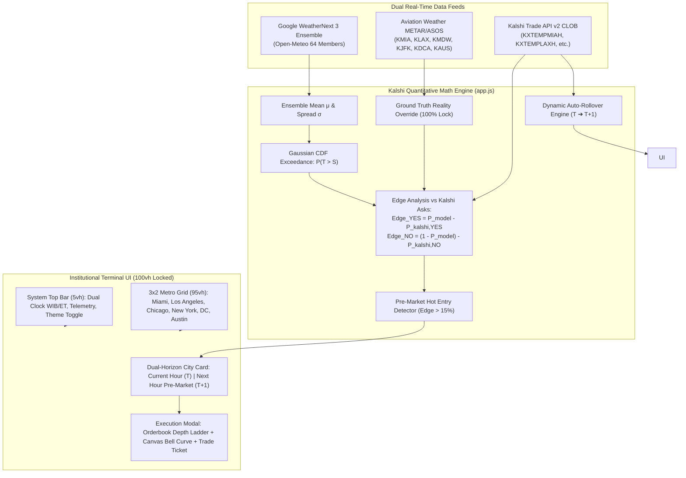

# AURA-WX TERMINAL // KALSHI QUANTITATIVE WEATHER AGENT

[](#)
[-10b981.svg)](#)
[](#)
[](#)
[](#)

> **AURA-WX TERMINAL** is an institutional-grade, real-time quantitative trading terminal and AI forecasting agent purpose-built exclusively for **Kalshi Hourly Directional Temperature Markets** across 6 core US metropolitan centers. Powered by the **Google WeatherNext 3 AI Ensemble** and live **METAR/ASOS Ground Truth**, it detects orderbook mispricings, projects upcoming $T+1$ strikes, and provides instant edge calculation for high-confidence manual execution.

---

## 🏛️ System Architecture



---

## 📍 6 Target Metro Centers & Kalshi Series Tickers

The terminal monitors 6 primary meteorological hubs using official Kalshi Series Tickers and official ICAO airport station readings:

| City | Kalshi Series Ticker | METAR Station | Coordinates | Timezone |
| :--- | :--- | :--- | :--- | :--- |
| **Miami** | `KXTEMPMIAH` | KMIA (Miami Intl) | 25.7959° N, 80.2870° W | America/New_York (EDT) |
| **Los Angeles** | `KXTEMPLAXH` | KLAX (Los Angeles Intl) | 33.9425° N, 118.4081° W | America/Los_Angeles (PDT) |
| **Chicago** | `KXTEMPCHIH` | KMDW (Midway Intl) | 41.7868° N, 87.7522° W | America/Chicago (CDT) |
| **New York** | `KXTEMPNYCH` | KJFK (John F. Kennedy Intl) | 40.6413° N, 73.7781° W | America/New_York (EDT) |
| **Washington DC** | `KXTEMPDCH` | KDCA (Ronald Reagan Natl) | 38.8512° N, 77.0402° W | America/New_York (EDT) |
| **Austin** | `KXTEMPAUSH` | KAUS (Austin-Bergstrom Intl) | 30.1975° N, 97.6664° W | America/Chicago (CDT) |

---

## 🧮 Quantitative Formulation & Engine Rules

### 1. Google WeatherNext 3 Ensemble Engine
The forecasting engine queries 64 ensemble forecast members of the Google WeatherNext model via Open-Meteo to calculate distribution parameters for any target hour $T$:
- **Mean Temperature ($\mu$)**:
  $$\mu = \frac{1}{M}\sum_{i=1}^M T_i$$
- **Dynamic Spread / Standard Deviation ($\sigma$)**:
  $$\sigma = \max\left(0.5^\circ\text{F}, \sqrt{\frac{1}{M-1}\sum_{i=1}^M (T_i - \mu)^2}\right)$$

### 2. Gaussian Cumulative Distribution Function (CDF)
For any active Kalshi strike $S$ (contract payout if $T > S$):
$$P(T > S) = 1 - \Phi\left(\frac{S - \mu}{\sigma}\right) = 1 - \frac{1}{2}\left[1 + \text{erf}\left(\frac{S - \mu}{\sigma \sqrt{2}}\right)\right]$$
where $\text{erf}(x)$ is computed via high-precision numerical approximation ($|\epsilon| < 1.5 \times 10^{-7}$).

### 3. METAR Ground Truth Reality Lock
Official METAR/ASOS readings are retrieved continuously from AviationWeather.gov:
- If current station temperature $T_{\text{METAR}} \ge S$ before the settlement window closes:
  $$P(T > S) \equiv 1.00 \quad (100\%\text{ Reality Lock})$$
  The contract outcome is locked and indicated visually with a 🔒 badge.

### 4. Kalshi CLOB Edge Analysis
Model probabilities are matched against real-time Kalshi orderbook asks:
$$\text{Edge}_{\text{YES}} = P_{\text{model}} - P_{\text{kalshi, YES}}$$
$$\text{Edge}_{\text{NO}} = (1 - P_{\text{model}}) - P_{\text{kalshi, NO}}$$
where $P_{\text{kalshi, YES}} = \text{Ask}_{\text{YES}} / 100$ and $P_{\text{kalshi, NO}} = \text{Ask}_{\text{NO}} / 100$.

### 5. Half-Kelly Position Sizing
Recommended capital allocation per trade:
$$f^* = \frac{p(b + 1) - 1}{b} \times 0.5$$
where $b = (100 - \text{Ask}) / \text{Ask}$. Sizing is capped at 25% to respect institutional portfolio drawdowns.

---

## 🔮 Pre-Market Predictor ($T+1$) & Hot Entry Detector

Each city card features a **Dual-Time Horizon Panel**:
- **Current Hour ($T$)**: Live METAR Ground Truth, active Kalshi ladder, settlement countdown timer, and active Edge matrix.
- **Next Hour ($T+1$)**: Google WeatherNext AI mean temperature forecast, ensemble standard deviation, and upcoming strike probability projections.
- **⚡ PRE-MARKET HOT ENTRY**: When Kalshi opens the $T+1$ orderbook, initial quotes are immediately evaluated against the AI theoretical model. If a mispricing of **$\text{Edge} \ge 15\%$** is discovered, the card illuminates with a glowing badge:
  `⚡ PRE-MARKET HOT ENTRY`

---

## ⏱️ Settlement Risk Zones & Dynamic Auto-Rollover

The terminal enforces strict trade discipline based on settlement proximity:
- 🟢 **SAFE ZONE** ($> 15$ minutes to settlement): Full trade execution permitted.
- 🟡 **HIGH VOLATILITY** ($5 - 15$ minutes to settlement): Rapid price convergence; reduce position sizing.
- 🔴 **LOCK / NO-TRADE ZONE** ($< 5$ minutes to settlement): Trading halted to protect capital from settlement freezes.

**Anti-Stuck Dynamic Rollover**: When the current hour contract reaches settlement, the engine seamlessly rolls the active trading view to $T+1$ without requiring page reload or manual URL inputs.

---

## 🖥️ Institutional UI & Single-Screen Viewport Lock

- **100vh Viewport Lock**: Engineered with strict CSS view constraints (`height: 100vh; overflow: hidden;` on desktop $\ge 1024\text{px}$) so all 6 cities, live feeds, and upcoming predictions are visible simultaneously without scrolling.
- **System Top Bar**: Dynamic dual clocks comparing local Western Indonesia Time (**WIB**) against Market Time (**ET**), feed telemetry indicators, and theme toggle.
- **Dark Obsidian & High-Contrast Light Themes**: Instant switching between institutional fintech dark mode and crisp daytime light mode.
- **Detail Execution Modal**: Clicking any city opens an orderbook depth ladder, real-time Canvas distribution bell curve with METAR needle pin, and a direct one-click trade execution ticket.

---

## 🚀 Deployment & Local Preview

This project is a standalone, client-side web application ready for deployment on **GitHub Pages**, **Vercel**, or local hosting.

### Local Run:
```bash
# Clone repository
git clone https://github.com/rabapuba/aura-wx-terminal.git
cd aura-wx-terminal

# Launch local HTTP server
python3 -m http.server 3000
```
Open [http://localhost:3000](http://localhost:3000) in your browser.

---

## 🛡️ Script Encapsulation & Security

All execution logic is strictly encapsulated inside the isolated module `KalshiAgent`:
- Zero private state or credentials leaked to `window` console.
- Multi-tier proxy fallback architecture ensures continuous uptime even behind restrictive CORS configurations.
- Automatic off-market strike filtering removes dead quotes ($0¢$ or $100¢$ with zero depth).

---

## ⚖️ License
MIT License © 2026 Rabapuba Quantitative Engineering.
